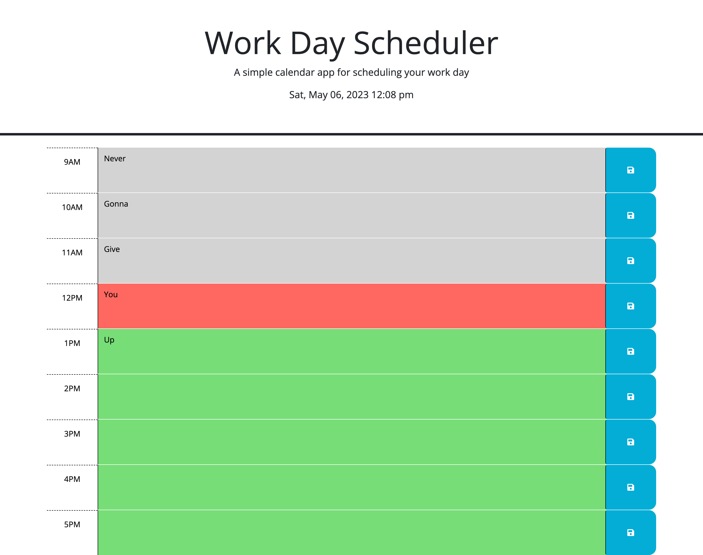

# 05 Third-Party APIs: Work Day Scheduler

## Your Task

Create a simple calendar application that allows a user to save events for each hour of the day by modifying starter code. This app will run in the browser and feature dynamically updated HTML and CSS powered by jQuery.

You'll need to use the [Day.js](https://day.js.org/en/) library to work with date and time. Be sure to read the documentation carefully and concentrate on using Day.js in the browser.

## User Story

```md
AS AN employee with a busy schedule
I WANT to add important events to a daily planner
SO THAT I can manage my time effectively
```

## Acceptance Criteria

```md
GIVEN I am using a daily planner to create a schedule
WHEN I open the planner
THEN the current day is displayed at the top of the calendar
WHEN I scroll down
THEN I am presented with timeblocks for standard business hours
WHEN I view the timeblocks for that day
THEN each timeblock is color coded to indicate whether it is in the past, present, or future
WHEN I click into a timeblock
THEN I can enter an event
WHEN I click the save button for that timeblock
THEN the text for that event is saved in local storage
WHEN I refresh the page
THEN the saved events persist
```
## Deplayed Application Link
Web App: https://konawave.github.io/class-calendar/
GitHub Repo: https://github.com/konawave/class-calendar

## Mock-up

© 2023 edX Boot Camps LLC. Confidential and Proprietary. All Rights Reserved.

## How to Use

* Enter any events, notes, or text you want to use in the boxed that are coloured either grey, red, or green.
  * Grey means that time has past, Red means it is currently that time, and Green means that time is in the future.
* Once you have entered your note, click the blue button to the right to save it. You will need to click this for each individual row if you want it saved. 
* Notes are dependent on local storage and will stay there even if you refresh the page.

## Future Development

* I would like to add a 'Clear' button that deletes local storage and resets the calendar. The next step after that would be to add clear buttons to each row so users can just click that instead of having to delete their text and click the save button again. 

## What I Learned

* jQuery is the name of the game! This application was a great lesson in jQuery and local storage. 
* I also learned how to incorporate standard JavaScript with some jQuery integrated. 
* My biggest challenge was figuring out the correct syntax to change the div classes to the appropriate color-class. 


